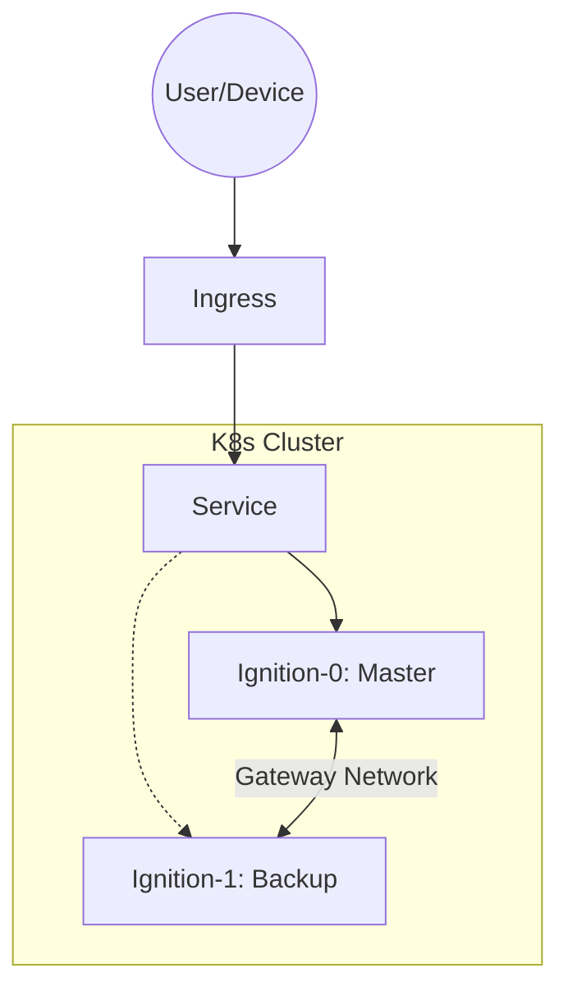
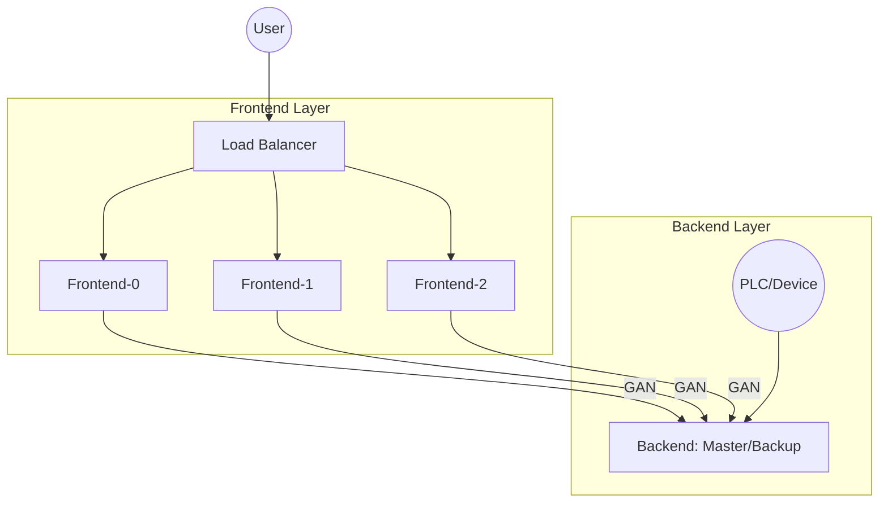

## Overview

This repository provides two primary architectures for deploying Ignition on Kubernetes.

### 1. Failover (Master/Backup)

The `ignition-failover` chart deploys a standard redundant pair of Ignition gateways.

* **Replicas**: 2 (Fixed)
* **State**: StatefulSet with stable network identities.
* **Networking**:
  * `0`: Master (Primary)
  * `1`: Backup (Redundant)
* **Use Case**: Standard SCADA deployments requiring high availability.

### 2. Scaleout (Frontend/Backend)

The `ignition-scaleout` chart separates the workload into two distinct StatefulSets:

* **Backend**: Handles device connections, database logging, and tag history.
* **Frontend**: Handles Perspective sessions and API requests.

This architecture allows you to scale the Frontend layer independently of the Backend layer to handle massive user loads.

