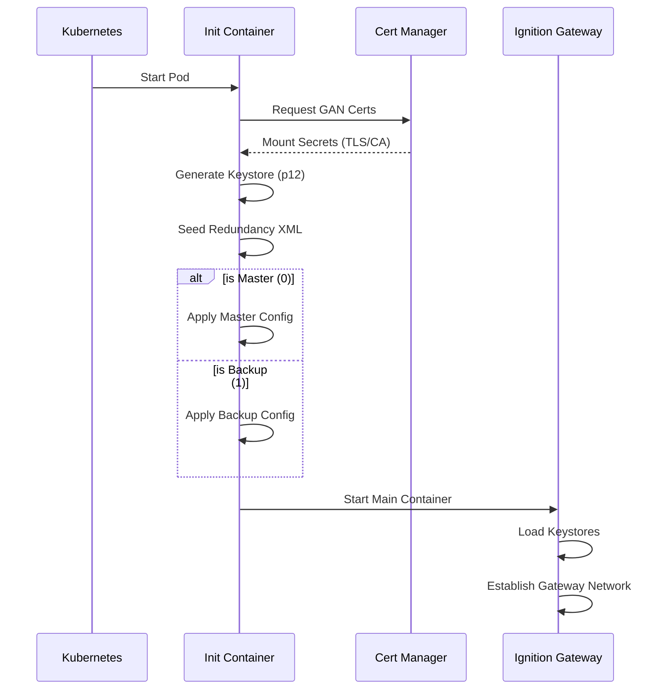

A Helm chart for failover Ignition Gateway with combined frontend/backend functionality. This chart deploys an Ignition Gateway configured for redundancy, capable of acting as both a frontend and backend in a simplified failover architecture.

## Initialization Process

The following diagram illustrates how the chart initializes redundancy and handles certificate exchange during startup.



## Configuration

The following sections list the configurable parameters of the ignition-failover chart, broken down by category.

### General Settings

Basic metadata and image configuration.

| Parameter | Type | Default |
| --------- | ---- | ------- |
| `applicationName` | string | `"ignition-failover"` |
| `image.repository` | string | `"inductiveautomation/ignition"` |
| `image.tag` | string | `"8.3"` |
| `image.pullPolicy` | string | `"IfNotPresent"` |
| `ignition.spoofMachineId` | string | `""` |

### Ignition Configuration

Core Ignition Gateway settings, including EULA acceptance and module selection.

| Parameter | Type | Default |
|-----------|------|---------|
| `ignition.config` | object | *(See below)* |
| `ignition.args` | list | *(See below)* |
| `ignition.logging.level` | string | `"INFO"` |
| `ignition.eam.role` | string | `"Controller"` |
| `ignition.tls.keystorePassword` | string | `"ignition"` |
| `ignition.gan.keystorePassword` | string | `"metro"` |

**Default `ignition.config`:**

```yaml
ACCEPT_IGNITION_EULA: "Y"
DISABLE_QUICKSTART: "true"
GATEWAY_ADMIN_USERNAME: "admin"
GATEWAY_MODULES_ENABLED: "perspective,symbol-factory,alarm-notification,modbus-driver-v2,opc-ua,reporting,siemens-drivers,sql-bridge,tag-historian,udp-tcp-drivers"
GATEWAY_NETWORK_REQUIRETWOWAYAUTH: "true"
GATEWAY_NETWORK_SECURITYPOLICY: "Unrestricted"
IGNITION_EDITION: "standard"
```

**Default `ignition.args`:**

```yaml
- "-m"
- "1024"
- "-n"
- "$(GATEWAY_SYSTEM_NAME)"
- "--"
- "gateway.useProxyForwardedHeader=true"
```

### Redundancy

Settings to control the Gateway's redundancy behavior.

| Parameter | Type | Default |
|-----------|------|---------|
| `ignition.redundancy.enabled` | bool | `false` |
| `ignition.redundancy` | object | *(See below)* |

**Default `ignition.redundancy`:**

```yaml
backupFailoverTimeout: 10000
enableSsl: true
enabled: false
httpConnectTimeout: 10000
httpReadTimeout: 60000
joinWaitTime: 30000
masterRecoveryMode: "Automatic"
maxDiskMb: 100
pingMaxMissed: 10
pingRate: 1000
pingTimeout: 300
syncTimeoutSecs: 60
websocketTimeout: 10000
```

### Persistence & Storage

Configuration for persistent data storage.

| Parameter | Type | Default |
|-----------|------|---------|
| `ignition.persistence.size` | string | `"3Gi"` |
| `ignition.persistence.accessModes` | list | `["ReadWriteOnce"]` |
| `ignition.persistence.storageClassName` | string | `""` |
| `ignition.localMounts` | list | `[]` |
| `ignition.restore.enabled` | bool | `false` |
| `ignition.restore.url` | string | `""` |

### Networking & Ingress

Service exposure and Ingress settings.

| Parameter | Type | Default |
|-----------|------|---------|
| `ignition.service.type` | string | `"NodePort"` |
| `ignition.service.ports` | object | `{"gan":8060,"http":8088,"https":8043}` |
| `ignition.service.nodePorts` | object | `{}` |
| `ignition.service.sessionAffinity` | string | `"ClientIP"` |
| `ignition.ingress.enabled` | bool | `false` |
| `ignition.ingress.tls` | list | `[]` |
| `certManager.issuer.name` | string | `"cluster-issuer"` |
| `certManager.issuer.kind` | string | `"ClusterIssuer"` |

### Resources & Scheduling

CPU/Memory requests/limits and pod affinity.

| Parameter | Type | Default |
|-----------|------|---------|
| `ignition.resources.requests` | object | `{"cpu":"500m","memory":"1Gi"}` |
| `ignition.resources.limits.cpu` | string | `"1000m"` |
| `ignition.resources.limits.memory` | string | `"2Gi"` |
| `affinity.enabled` | bool | `false` |
| `affinity.type` | string | `"soft"` |
| `affinity.topologyKey` | string | `"kubernetes.io/hostname"` |

### Probes

Health checks for the pod.

| Parameter | Type | Default |
|-----------|------|---------|
| `ignition.livenessProbe` | object | *(See below)* |
| `ignition.readinessProbe` | object | *(See below)* |

**Default `ignition.livenessProbe`:**

```yaml
command: ["health-check.sh", "-t", "5"]
enabled: true
failureThreshold: 3
initialDelaySeconds: 120
periodSeconds: 10
timeoutSeconds: 5
```

**Default `ignition.readinessProbe`:**

```yaml
command: ["health-check.sh", "-t", "3"]
enabled: true
failureThreshold: 10
initialDelaySeconds: 60
periodSeconds: 5
timeoutSeconds: 3
```

### Security & Accounts

Security context and Service Account settings.

| Parameter | Type | Default |
|-----------|------|---------|
| `ignition.securityContext` | object | `{"fsGroup":2003,"runAsGroup":2003,"runAsNonRoot":true,"runAsUser":2003}` |
| `ignition.secrets` | object | `{"GATEWAY_ADMIN_PASSWORD":"admin"}` |
| `ignition.sealedSecrets` | bool | `false` |
| `serviceAccount.create` | bool | `false` |
| `serviceAccount.name` | string | `""` |
| `serviceAccount.annotations` | object | `{}` |
