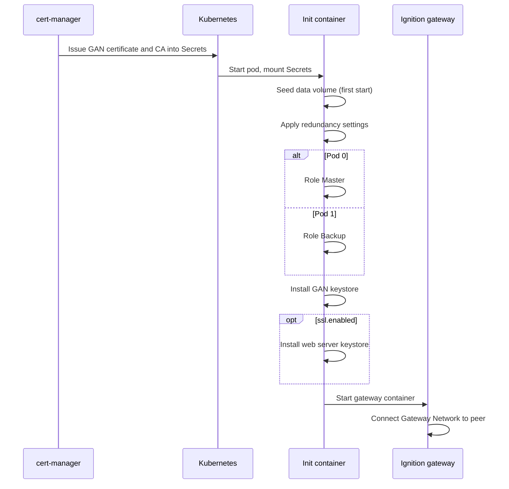

`ignition-failover` deploys a single Ignition gateway, or a Master/Backup redundant pair, that serves both devices and users. This page describes how it starts up and lists its values. For installation, see the [installation guide](../../guides/installation/).

## Startup

Before the gateway starts, the `preconfigure` init container prepares its data volume. cert-manager has already issued the Gateway Network certificate into a Secret, which the pod mounts.

The chart also creates two headless Services, `<name>-primary` and `<name>-backup`, that always target pod ordinals 0 and 1, so you can reach a specific gateway directly. `<name>` is `applicationName` (default `ignition-failover`).



> **Upgrading from 4.0.0 or earlier?** It needs a one-time step; see the [upgrading guide](../../guides/upgrading/).

## Values

The tables below list the chart's values and defaults, grouped by area. [`values.yaml`](https://github.com/Apollogeddon/ignition-helm/blob/main/charts/failover/values.yaml) is the authoritative list.

### General

Resource naming and the container image.

| Parameter | Type | Default |
| --- | --- | --- |
| `applicationName` | string | `"ignition-failover"` |
| `image.repository` | string | `"inductiveautomation/ignition"` |
| `image.tag` | string | `""` (the chart's `appVersion`, 8.3.1) |
| `image.pullPolicy` | string | `"IfNotPresent"` |
| `image.imagePullSecrets` | list | unset |

### Web server TLS

Serve HTTPS with your own PKCS#12 keystore. `ignition.ssl.secretName` defaults to `<name>-web-tls`.

| Parameter | Type | Default |
| --- | --- | --- |
| `ignition.ssl.enabled` | bool | `false` |
| `ignition.ssl.secretName` | string | `""` |

### Network policy and monitoring

| Parameter | Type | Default |
| --- | --- | --- |
| `ignition.networkPolicy.enabled` | bool | `true` |
| `ignition.networkPolicy.extraIngress` | list | `[]` |
| `ignition.serviceMonitor.enabled` | bool | `false` |
| `ignition.serviceMonitor.interval` | string | `"30s"` |
| `ignition.serviceMonitor.path` | string | `"/data/metrics"` |
| `ignition.serviceMonitor.additionalLabels` | object | `{}` |

### Gateway

Gateway environment variables (including EULA acceptance and enabled modules), arguments, logging and the EAM role.

| Parameter | Type | Default |
| --- | --- | --- |
| `ignition.config` | object | *(See below)* |
| `ignition.args` | list | *(See below)* |
| `ignition.logging.level` | string | `"INFO"` |
| `ignition.logging.wrapperLogToStdout` | bool | `true` |
| `ignition.logging.loggers` | object | `{}` |
| `ignition.logging.sqlite` | object | `{}` |
| `ignition.eam.role` | string | `"Controller"` |

**Default `ignition.config`:**

```yaml
IGNITION_EDITION: standard
ACCEPT_IGNITION_EULA: "Y"
DISABLE_QUICKSTART: "true"
GATEWAY_NETWORK_SECURITYPOLICY: Unrestricted
GATEWAY_NETWORK_REQUIRETWOWAYAUTH: "true"
GATEWAY_MODULES_ENABLED: perspective,symbol-factory,alarm-notification,modbus-driver-v2,opc-ua,reporting,siemens-drivers,sql-bridge,tag-historian,udp-tcp-drivers
```

**Default `ignition.args`:**

```yaml
- "-m"
- "1024"
- "-n"
- $(GATEWAY_SYSTEM_NAME)
- "--"
- gateway.useProxyForwardedHeader=true
```

### Redundancy

Redundancy settings, applied to each gateway's data volume on every start.

| Parameter | Type | Default |
| --- | --- | --- |
| `ignition.redundancy.enabled` | bool | `false` |
| `ignition.redundancy` | object | *(See below)* |
| `ignition.activeRouting` | object | `{"enabled":false,"image":"alpine/kubectl:1.34.1","intervalSeconds":2,"unknownHold":3,"resources":{"requests":{"cpu":"10m","memory":"32Mi"},"limits":{"cpu":"200m","memory":"128Mi"}}}` |

**Default `ignition.redundancy`:**

```yaml
enabled: false
pingRate: 1000
pingTimeout: 300
pingMaxMissed: 10
enableSsl: true
joinWaitTime: 30000
websocketTimeout: 10000
syncTimeoutSecs: 60
maxDiskMb: 100
masterRecoveryMode: Automatic
httpConnectTimeout: 10000
httpReadTimeout: 60000
backupFailoverTimeout: 10000
```

### Persistence and storage

| Parameter | Type | Default |
| --- | --- | --- |
| `ignition.persistence.size` | string | `"3Gi"` |
| `ignition.persistence.accessModes` | list | `["ReadWriteOnce"]` |
| `ignition.persistence.storageClassName` | string | `""` |
| `ignition.localMounts` | list | `[]` |
| `ignition.restore.enabled` | bool | `false` |
| `ignition.restore.url` | string | `""` |
| `ignition.restore.path` | string | unset |
| `ignition.externalModules.enabled` | bool | `false` |
| `ignition.externalModules.pvcName` | string | `""` |
| `ignition.emptyDirSizeLimit` | object | `{"logs":"","temp":"","dotIgnition":""}` |
| `ignition.fixDataOwnership` | bool | `false` |

### Networking and certificates

Service, Ingress and cert-manager settings.

| Parameter | Type | Default |
| --- | --- | --- |
| `ignition.service.type` | string | `"NodePort"` |
| `ignition.service.ports` | object | `{"http":8088,"https":8043,"gan":8060}` |
| `ignition.service.nodePorts` | object | unset |
| `ignition.service.sessionAffinity` | string | `"None"` |
| `ignition.service.annotations` | object | unset |
| `ignition.ingress.enabled` | bool | `false` |
| `ignition.ingress.className` | string | `""` |
| `ignition.ingress.annotations` | object | unset |
| `ignition.ingress.hosts` | list | unset |
| `ignition.ingress.tls` | list | `[]` |
| `certManager.issuer.name` | string | `"cluster-issuer"` |
| `certManager.issuer.kind` | string | `"ClusterIssuer"` |
| `certManager.rotation.enabled` | bool | `false` |
| `certManager.rotation.schedule` | string | `"0 7 * * *"` |
| `certManager.restartOnRenewal` | object | `{"enabled":false,"schedule":"*/15 * * * *","image":"alpine/kubectl:1.34.1"}` |

### Resources and scheduling

CPU and memory, the update strategy and pod anti-affinity. `affinity.type` is `soft` (preferred) or `hard` (required).

| Parameter | Type | Default |
| --- | --- | --- |
| `ignition.resources.requests` | object | `{"memory":"1Gi","cpu":"500m"}` |
| `ignition.resources.limits.cpu` | string | `"1000m"` |
| `ignition.resources.limits.memory` | string | `"2Gi"` |
| `ignition.initResources` | object | `{"requests":{"memory":"128Mi","cpu":"100m"},"limits":{"memory":"256Mi","cpu":"200m"}}` |
| `ignition.updateStrategy.type` | string | `"RollingUpdate"` |
| `affinity.enabled` | bool | `false` |
| `affinity.type` | string | `"soft"` |
| `affinity.topologyKey` | string | `"kubernetes.io/hostname"` |

### Probes

Health checks for the gateway container. A `command` you set is used as-is.

| Parameter | Type | Default |
| --- | --- | --- |
| `ignition.livenessProbe` | object | *(See below)* |
| `ignition.readinessProbe` | object | *(See below)* |
| `ignition.startupProbe` | object | `{"enabled":false,"initialDelaySeconds":30,"periodSeconds":10,"failureThreshold":30,"timeoutSeconds":5,"command":["/config/scripts/health-check.sh","-t","5"]}` |
| `ignition.lifecycle` | object | `{}` |

**Default `ignition.livenessProbe`:**

```yaml
enabled: true
initialDelaySeconds: 120
periodSeconds: 10
failureThreshold: 3
timeoutSeconds: 5
command:
  - /config/scripts/health-check.sh
  - "-t"
  - "5"
```

**Default `ignition.readinessProbe`:**

```yaml
enabled: true
initialDelaySeconds: 120
periodSeconds: 5
failureThreshold: 10
timeoutSeconds: 3
command:
  - /config/scripts/health-check.sh
  - "-t"
  - "3"
  - "-r"
```

### Security and accounts

Security context, secrets and the ServiceAccount. With `ignition.sealedSecrets`, the `ignition.secrets` values must be encrypted with `kubeseal`.

| Parameter | Type | Default |
| --- | --- | --- |
| `ignition.securityContext` | object | `{"runAsUser":2003,"runAsGroup":2003,"fsGroup":2003,"runAsNonRoot":true}` |
| `ignition.secrets` | object | `{"GATEWAY_ADMIN_USERNAME":"admin","GATEWAY_ADMIN_PASSWORD":"admin","IGNITION_GAN_KEYSTORE_PASSWORD":"metro","IGNITION_WEB_KEYSTORE_PASSWORD":"ignition"}` |
| `ignition.sealedSecrets` | bool | `false` |
| `serviceAccount.create` | bool | `false` |
| `serviceAccount.name` | string | `""` |
| `serviceAccount.annotations` | object | `{}` |
