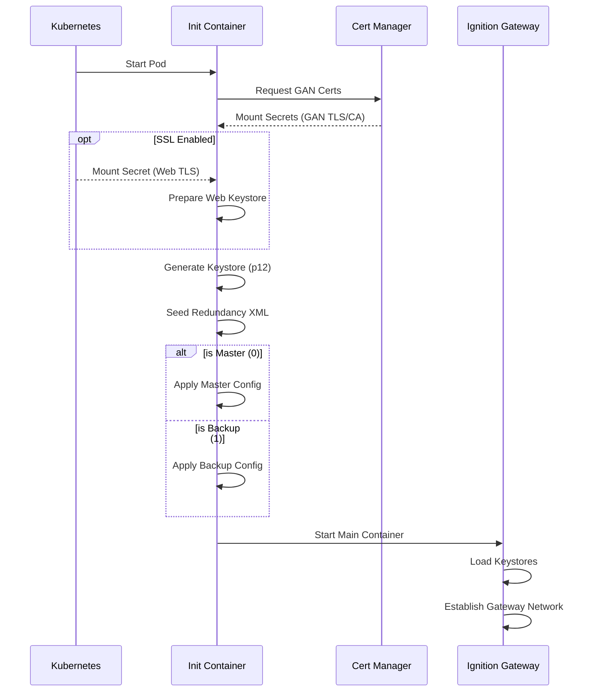

A Helm chart for failover Ignition Gateway with combined frontend/backend functionality. This chart deploys an Ignition Gateway configured for redundancy, capable of acting as both a frontend and backend in a simplified failover architecture.

## Initialization Process

The following diagram illustrates how the chart initializes redundancy and handles certificate exchange during startup.

> **Note:** The chart automatically creates two headless services (`-primary` and `-backup`) which always target pod ordinal 0 and 1 respectively, allowing for direct diagnostics of a specific node.



> **Upgrading from 4.0.0 or earlier?** It needs a one-time step; see the [Upgrading guide](../../guides/upgrading/).

## Configuration

The following sections list the configurable parameters of the ignition-failover chart, broken down by category.

### General Settings

Basic metadata and image configuration.

| Parameter | Type | Default |
| --- | --- | --- |
| `applicationName` | string | `"ignition-failover"` |
| `image.repository` | string | `"inductiveautomation/ignition"` |
| `image.tag` | string | `""` |
| `image.pullPolicy` | string | `"IfNotPresent"` |

### Web Server SSL/TLS

Configuration for providing a custom keystore for the Web Server (HTTPS).

| Parameter | Type | Default |
| --- | --- | --- |
| `ignition.ssl.enabled` | bool | `false` |
| `ignition.ssl.secretName` | string | `""` |

### Security & Monitoring

Advanced security and observability settings.

| Parameter | Type | Default |
| --- | --- | --- |
| `ignition.networkPolicy.enabled` | bool | `true` |
| `ignition.networkPolicy.extraIngress` | list | `[]` |
| `ignition.serviceMonitor.enabled` | bool | `false` |
| `ignition.serviceMonitor.interval` | string | `"30s"` |
| `ignition.serviceMonitor.path` | string | `"/data/metrics"` |

### Ignition Configuration

Core Ignition Gateway settings, including EULA acceptance and module selection.

| Parameter | Type | Default |
| --- | --- | --- |
| `ignition.config` | object | *(See below)* |
| `ignition.args` | list | *(See below)* |
| `ignition.logging.level` | string | `"INFO"` |
| `ignition.logging.wrapperLogToStdout` | bool | `true` |
| `ignition.logging.loggers` | object | `{}` |
| `ignition.logging.sqlite` | object | `{}` |
| `ignition.eam.role` | string | `"Controller"` |

**Default `ignition.config`:**

```yaml
IGNITION_EDITION: standard
ACCEPT_IGNITION_EULA: "Y"
DISABLE_QUICKSTART: "true"
GATEWAY_NETWORK_SECURITYPOLICY: Unrestricted
GATEWAY_NETWORK_REQUIRETWOWAYAUTH: "true"
GATEWAY_MODULES_ENABLED: perspective,symbol-factory,alarm-notification,modbus-driver-v2,opc-ua,reporting,siemens-drivers,sql-bridge,tag-historian,udp-tcp-drivers
```

**Default `ignition.args`:**

```yaml
- "-m"
- "1024"
- "-n"
- $(GATEWAY_SYSTEM_NAME)
- "--"
- gateway.useProxyForwardedHeader=true
```

### Redundancy

Settings to control the Gateway's redundancy behavior.

| Parameter | Type | Default |
| --- | --- | --- |
| `ignition.redundancy.enabled` | bool | `false` |
| `ignition.redundancy` | object | *(See below)* |
| `ignition.activeRouting` | object | `{"enabled":false,"image":"alpine/kubectl:1.34.1","intervalSeconds":2,"unknownHold":3,"resources":{"requests":{"cpu":"10m","memory":"32Mi"},"limits":{"cpu":"200m","memory":"128Mi"}}}` |

**Default `ignition.redundancy`:**

```yaml
enabled: false
pingRate: 1000
pingTimeout: 300
pingMaxMissed: 10
enableSsl: true
joinWaitTime: 30000
websocketTimeout: 10000
syncTimeoutSecs: 60
maxDiskMb: 100
masterRecoveryMode: Automatic
httpConnectTimeout: 10000
httpReadTimeout: 60000
backupFailoverTimeout: 10000
```

### Persistence & Storage

Configuration for persistent data storage.

| Parameter | Type | Default |
| --- | --- | --- |
| `ignition.persistence.size` | string | `"3Gi"` |
| `ignition.persistence.accessModes` | list | `["ReadWriteOnce"]` |
| `ignition.persistence.storageClassName` | string | `""` |
| `ignition.localMounts` | list | `[]` |
| `ignition.restore.enabled` | bool | `false` |
| `ignition.restore.url` | string | `""` |
| `ignition.emptyDirSizeLimit` | object | `{"logs":"","temp":"","dotIgnition":""}` |
| `ignition.fixDataOwnership` | bool | `false` |

### Networking & Ingress

Service exposure and Ingress settings.

| Parameter | Type | Default |
| --- | --- | --- |
| `ignition.service.type` | string | `"NodePort"` |
| `ignition.service.ports` | object | `{"http":8088,"https":8043,"gan":8060}` |
| `ignition.service.nodePorts` | object | unset |
| `ignition.service.sessionAffinity` | string | `"None"` |
| `ignition.ingress.enabled` | bool | `false` |
| `ignition.ingress.className` | string | `""` |
| `ignition.ingress.tls` | list | `[]` |
| `certManager.issuer.name` | string | `"cluster-issuer"` |
| `certManager.issuer.kind` | string | `"ClusterIssuer"` |
| `certManager.rotation.enabled` | bool | `false` |
| `certManager.rotation.schedule` | string | `"0 7 * * *"` |
| `certManager.restartOnRenewal` | object | `{"enabled":false,"schedule":"*/15 * * * *","image":"alpine/kubectl:1.34.1"}` |

### Resources & Scheduling

CPU/Memory requests/limits and pod affinity.

| Parameter | Type | Default |
| --- | --- | --- |
| `ignition.resources.requests` | object | `{"memory":"1Gi","cpu":"500m"}` |
| `ignition.resources.limits.cpu` | string | `"1000m"` |
| `ignition.resources.limits.memory` | string | `"2Gi"` |
| `affinity.enabled` | bool | `false` |
| `affinity.type` | string | `"soft"` |
| `affinity.topologyKey` | string | `"kubernetes.io/hostname"` |

### Probes

Health checks for the pod.

| Parameter | Type | Default |
| --- | --- | --- |
| `ignition.livenessProbe` | object | *(See below)* |
| `ignition.readinessProbe` | object | *(See below)* |
| `ignition.startupProbe` | object | `{"enabled":false,"initialDelaySeconds":30,"periodSeconds":10,"failureThreshold":30,"timeoutSeconds":5,"command":["/config/scripts/health-check.sh","-t","5"]}` |
| `ignition.lifecycle` | object | `{}` |

**Default `ignition.livenessProbe`:**

```yaml
enabled: true
initialDelaySeconds: 120
periodSeconds: 10
failureThreshold: 3
timeoutSeconds: 5
command:
  - /config/scripts/health-check.sh
  - "-t"
  - "5"
```

**Default `ignition.readinessProbe`:**

```yaml
enabled: true
initialDelaySeconds: 120
periodSeconds: 5
failureThreshold: 10
timeoutSeconds: 3
command:
  - /config/scripts/health-check.sh
  - "-t"
  - "3"
  - "-r"
```

### Security & Accounts

Security context and Service Account settings.

| Parameter | Type | Default |
| --- | --- | --- |
| `ignition.securityContext` | object | `{"runAsUser":2003,"runAsGroup":2003,"fsGroup":2003,"runAsNonRoot":true}` |
| `ignition.secrets` | object | `{"GATEWAY_ADMIN_USERNAME":"admin","GATEWAY_ADMIN_PASSWORD":"admin","IGNITION_GAN_KEYSTORE_PASSWORD":"metro","IGNITION_WEB_KEYSTORE_PASSWORD":"ignition"}` |
| `ignition.sealedSecrets` | bool | `false` |
| `serviceAccount.create` | bool | `false` |
| `serviceAccount.name` | string | `""` |
| `serviceAccount.annotations` | object | `{}` |
