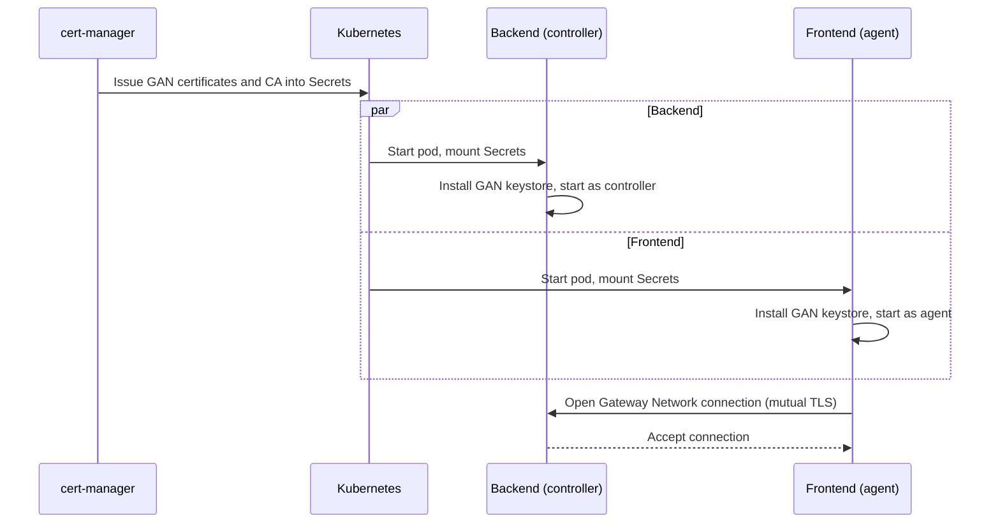

`ignition-scaleout` deploys two sets of Ignition gateways: a backend (one gateway or a redundant pair, EAM controller) for devices, databases and tag history, and a frontend (any number of gateways, EAM agents) for user sessions. This page describes how they start up and lists the chart's values. For installation, see the [installation guide](../../guides/installation/).

## Startup

cert-manager issues each layer's Gateway Network certificate from a CA the chart creates. The frontend gateways are given the backend pods' addresses and open Gateway Network connections to them.

The chart also creates two headless Services for the backend, `<name>-backend-primary` and `<name>-backend-backup`, that always target backend pod ordinals 0 and 1, so you can reach a specific gateway directly. `<name>` is `applicationName` (default `ignition-scaleout`).



> **Upgrading from 4.0.0 or earlier?** It needs a one-time step; see the [upgrading guide](../../guides/upgrading/).

## Values

The tables below list the chart's values and defaults, grouped by layer and area. [`values.yaml`](https://github.com/Apollogeddon/ignition-helm/blob/main/charts/scaleout/values.yaml) is the authoritative list.

### General

Settings that apply to both layers. `affinity.type` is not set by default, which gives required (hard) anti-affinity when `affinity.enabled` is on; set it to `soft` for preferred.

| Parameter | Type | Default |
| --- | --- | --- |
| `applicationName` | string | `"ignition-scaleout"` |
| `image.repository` | string | `"inductiveautomation/ignition"` |
| `image.tag` | string | `""` (the chart's `appVersion`, 8.3.1) |
| `image.pullPolicy` | string | `"IfNotPresent"` |
| `image.imagePullSecrets` | list | unset |
| `affinity.enabled` | bool | `false` |
| `affinity.type` | string | unset (hard) |
| `affinity.topologyKey` | string | `"kubernetes.io/hostname"` |
| `certManager.issuer.name` | string | `"cluster-issuer"` |
| `certManager.issuer.kind` | string | `"ClusterIssuer"` |
| `certManager.rotation.enabled` | bool | `false` |
| `certManager.rotation.schedule` | string | `"0 7 * * *"` |
| `certManager.restartOnRenewal` | object | `{"enabled":false,"schedule":"*/15 * * * *","image":"alpine/kubectl:1.34.1"}` |
| `serviceAccount.create` | bool | `false` |
| `serviceAccount.name` | string | `""` |
| `serviceAccount.annotations` | object | `{}` |

### Backend

The backend is the EAM controller and runs devices, databases and tag history.

#### Gateway (backend)

| Parameter | Type | Default |
| --- | --- | --- |
| `backend.config` | object | *(See below)* |
| `backend.args` | list | *(See below)* |
| `backend.logging.level` | string | `"INFO"` |
| `backend.logging.wrapperLogToStdout` | bool | `true` |
| `backend.logging.loggers` | object | `{}` |
| `backend.logging.sqlite` | object | `{}` |
| `backend.eam.role` | string | `"Controller"` |

**Default `backend.config`:**

```yaml
IGNITION_EDITION: standard
ACCEPT_IGNITION_EULA: "Y"
DISABLE_QUICKSTART: "true"
GATEWAY_NETWORK_SECURITYPOLICY: Unrestricted
GATEWAY_NETWORK_REQUIRETWOWAYAUTH: "true"
GATEWAY_MODULES_ENABLED: alarm-notification,modbus-driver-v2,opc-ua,reporting,siemens-drivers,sql-bridge,tag-historian,udp-tcp-drivers
```

**Default `backend.args`:**

```yaml
- "-m"
- "1024"
- "-n"
- $(GATEWAY_SYSTEM_NAME)
- "--"
- gateway.useProxyForwardedHeader=true
```

#### Web server TLS (backend)

| Parameter | Type | Default |
| --- | --- | --- |
| `backend.ssl.enabled` | bool | `false` |
| `backend.ssl.secretName` | string | `""` |

#### Network policy and monitoring (backend)

| Parameter | Type | Default |
| --- | --- | --- |
| `backend.networkPolicy.enabled` | bool | `true` |
| `backend.networkPolicy.extraIngress` | list | `[]` |
| `backend.serviceMonitor.enabled` | bool | `false` |
| `backend.serviceMonitor.interval` | string | `"30s"` |
| `backend.serviceMonitor.path` | string | `"/data/metrics"` |

#### Redundancy (backend)

| Parameter | Type | Default |
| --- | --- | --- |
| `backend.redundancy.enabled` | bool | `false` |
| `backend.redundancy` | object | *(See below)* |
| `backend.activeRouting` | object | `{"enabled":false,"image":"alpine/kubectl:1.34.1","intervalSeconds":2,"unknownHold":3,"resources":{"requests":{"cpu":"10m","memory":"32Mi"},"limits":{"cpu":"200m","memory":"128Mi"}}}` |

**Default `backend.redundancy`:**

```yaml
enabled: false
pingRate: 1000
pingTimeout: 300
pingMaxMissed: 10
enableSsl: true
joinWaitTime: 30000
websocketTimeout: 10000
syncTimeoutSecs: 60
maxDiskMb: 100
masterRecoveryMode: Automatic
httpConnectTimeout: 10000
httpReadTimeout: 60000
backupFailoverTimeout: 10000
```

#### Persistence (backend)

| Parameter | Type | Default |
| --- | --- | --- |
| `backend.persistence.size` | string | `"3Gi"` |
| `backend.persistence.accessModes` | list | `["ReadWriteOnce"]` |
| `backend.persistence.storageClassName` | string | `""` |
| `backend.localMounts` | list | `[]` |
| `backend.restore.enabled` | bool | `false` |
| `backend.restore.url` | string | `""` |
| `backend.restore.path` | string | unset |
| `backend.emptyDirSizeLimit` | object | `{"logs":"","temp":"","dotIgnition":""}` |
| `backend.fixDataOwnership` | bool | `false` |

#### Networking (backend)

| Parameter | Type | Default |
| --- | --- | --- |
| `backend.service.type` | string | `"NodePort"` |
| `backend.service.ports` | object | `{"http":8088,"https":8043,"gan":8060}` |
| `backend.service.nodePorts` | object | unset |
| `backend.service.sessionAffinity` | string | `"None"` |
| `backend.ingress.enabled` | bool | `false` |
| `backend.ingress.className` | string | `""` |
| `backend.ingress.hosts` | list | unset |
| `backend.ingress.tls` | list | `[]` |

#### Resources and security (backend)

| Parameter | Type | Default |
| --- | --- | --- |
| `backend.resources.requests` | object | `{"memory":"1Gi","cpu":"500m"}` |
| `backend.resources.limits.cpu` | string | `"1000m"` |
| `backend.resources.limits.memory` | string | `"2Gi"` |
| `backend.updateStrategy.type` | string | `"RollingUpdate"` |
| `backend.externalModules.enabled` | bool | `false` |
| `backend.externalModules.pvcName` | string | `""` |
| `backend.securityContext` | object | `{"runAsUser":2003,"runAsGroup":2003,"fsGroup":2003,"runAsNonRoot":true}` |
| `backend.secrets` | object | `{"GATEWAY_ADMIN_USERNAME":"admin","GATEWAY_ADMIN_PASSWORD":"admin","IGNITION_GAN_KEYSTORE_PASSWORD":"metro","IGNITION_WEB_KEYSTORE_PASSWORD":"ignition"}` |
| `backend.sealedSecrets` | bool | `false` |

#### Probes (backend)

| Parameter | Type | Default |
| --- | --- | --- |
| `backend.livenessProbe` | object | *(See below)* |
| `backend.readinessProbe` | object | *(See below)* |
| `backend.startupProbe` | object | `{"enabled":false,"initialDelaySeconds":30,"periodSeconds":10,"failureThreshold":30,"timeoutSeconds":5,"command":["/config/scripts/health-check.sh","-t","5"]}` |
| `backend.lifecycle` | object | `{}` |

**Default `backend.livenessProbe`:**

```yaml
enabled: true
initialDelaySeconds: 120
periodSeconds: 10
failureThreshold: 3
timeoutSeconds: 5
command:
  - /config/scripts/health-check.sh
  - "-t"
  - "5"
```

**Default `backend.readinessProbe`:**

```yaml
enabled: true
initialDelaySeconds: 120
periodSeconds: 5
failureThreshold: 10
timeoutSeconds: 3
command:
  - /config/scripts/health-check.sh
  - "-t"
  - "3"
  - "-r"
```

### Frontend

The frontend gateways are EAM agents and serve user sessions. They have no persistent volumes.

#### Gateway (frontend)

| Parameter | Type | Default |
| --- | --- | --- |
| `frontend.config` | object | *(See below)* |
| `frontend.args` | list | *(See below)* |
| `frontend.logging.level` | string | `"INFO"` |
| `frontend.logging.wrapperLogToStdout` | bool | `true` |
| `frontend.logging.loggers` | object | `{}` |
| `frontend.logging.sqlite` | object | `{}` |
| `frontend.eam.role` | string | `"Agent"` |

**Default `frontend.config`:**

```yaml
IGNITION_EDITION: standard
ACCEPT_IGNITION_EULA: "Y"
DISABLE_QUICKSTART: "true"
GATEWAY_NETWORK_SECURITYPOLICY: Unrestricted
GATEWAY_NETWORK_REQUIRETWOWAYAUTH: "true"
GATEWAY_MODULES_ENABLED: perspective,symbol-factory
```

**Default `frontend.args`:**

```yaml
- "-m"
- "1024"
- "-n"
- $(GATEWAY_SYSTEM_NAME)
- "--"
- gateway.useProxyForwardedHeader=true
```

#### Web server TLS (frontend)

| Parameter | Type | Default |
| --- | --- | --- |
| `frontend.ssl.enabled` | bool | `false` |
| `frontend.ssl.secretName` | string | `""` |

#### Network policy and monitoring (frontend)

| Parameter | Type | Default |
| --- | --- | --- |
| `frontend.networkPolicy.enabled` | bool | `true` |
| `frontend.networkPolicy.extraIngress` | list | `[]` |
| `frontend.serviceMonitor.enabled` | bool | `false` |
| `frontend.serviceMonitor.interval` | string | `"30s"` |
| `frontend.serviceMonitor.path` | string | `"/data/metrics"` |

#### Scaling (frontend)

| Parameter | Type | Default |
| --- | --- | --- |
| `frontend.redundancy.replicas` | int | `1` |
| `frontend.hpa.enabled` | bool | `false` |
| `frontend.hpa.minReplicas` | int | `1` |
| `frontend.hpa.maxReplicas` | int | `10` |
| `frontend.hpa.targetCPUUtilizationPercentage` | int | `80` |

#### Networking (frontend)

| Parameter | Type | Default |
| --- | --- | --- |
| `frontend.service.type` | string | `"NodePort"` |
| `frontend.service.ports` | object | `{"http":8088,"https":8043,"gan":8060}` |
| `frontend.service.nodePorts` | object | unset |
| `frontend.service.sessionAffinity` | string | `"None"` |
| `frontend.ingress.enabled` | bool | `false` |
| `frontend.ingress.className` | string | `""` |
| `frontend.ingress.hosts` | list | unset |
| `frontend.ingress.tls` | list | `[]` |

#### Resources and security (frontend)

| Parameter | Type | Default |
| --- | --- | --- |
| `frontend.resources.requests` | object | `{"memory":"1Gi","cpu":"500m"}` |
| `frontend.resources.limits.cpu` | string | `"1000m"` |
| `frontend.resources.limits.memory` | string | `"2Gi"` |
| `frontend.updateStrategy.type` | string | `"RollingUpdate"` |
| `frontend.externalModules.enabled` | bool | `false` |
| `frontend.externalModules.pvcName` | string | `""` |
| `frontend.localMounts` | list | `[]` |
| `frontend.emptyDirSizeLimit` | object | `{"logs":"","temp":"","dotIgnition":""}` |
| `frontend.fixDataOwnership` | bool | `false` |
| `frontend.securityContext` | object | `{"runAsUser":2003,"runAsGroup":2003,"fsGroup":2003,"runAsNonRoot":true}` |
| `frontend.secrets` | object | `{"GATEWAY_ADMIN_USERNAME":"admin","GATEWAY_ADMIN_PASSWORD":"admin","IGNITION_GAN_KEYSTORE_PASSWORD":"metro","IGNITION_WEB_KEYSTORE_PASSWORD":"ignition"}` |
| `frontend.sealedSecrets` | bool | `false` |

#### Probes (frontend)

| Parameter | Type | Default |
| --- | --- | --- |
| `frontend.livenessProbe` | object | *(See below)* |
| `frontend.readinessProbe` | object | *(See below)* |
| `frontend.startupProbe` | object | `{"enabled":false,"initialDelaySeconds":30,"periodSeconds":10,"failureThreshold":30,"timeoutSeconds":5,"command":["/config/scripts/health-check.sh","-t","5"]}` |
| `frontend.lifecycle` | object | `{}` |

**Default `frontend.livenessProbe`:**

```yaml
enabled: true
initialDelaySeconds: 120
periodSeconds: 10
failureThreshold: 3
timeoutSeconds: 5
command:
  - /config/scripts/health-check.sh
  - "-t"
  - "5"
```

**Default `frontend.readinessProbe`:**

```yaml
enabled: true
initialDelaySeconds: 15
periodSeconds: 5
failureThreshold: 10
timeoutSeconds: 3
command:
  - /config/scripts/health-check.sh
  - "-t"
  - "3"
  - "-r"
```
