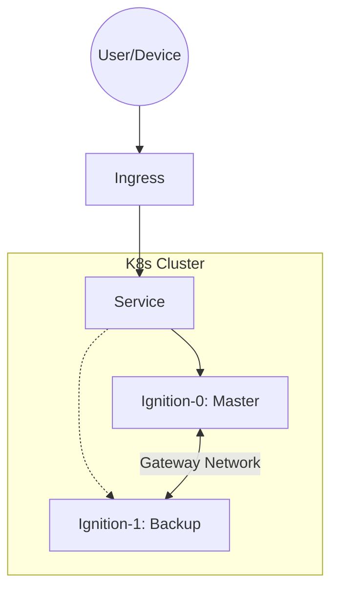
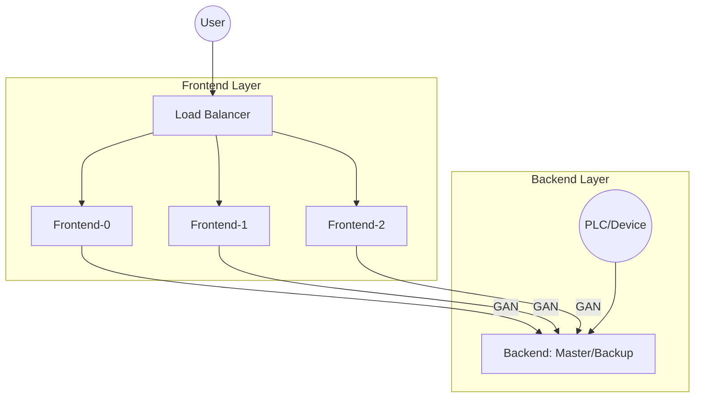

## Overview

This repository provides two primary architectures for deploying Ignition on Kubernetes.

### 1. Failover (Master/Backup)

The `ignition-failover` chart deploys a standard redundant pair of Ignition gateways.

* **Replicas**: 2 (Fixed)
* **State**: StatefulSet with stable network identities.
* **Networking**:
  * `0`: Master (Primary)
  * `1`: Backup (Redundant)
* **Use Case**: Standard SCADA deployments requiring high availability.

### 2. Scaleout (Frontend/Backend)

The `ignition-scaleout` chart separates the workload into two distinct StatefulSets:

* **Backend**: Handles device connections, database logging, and tag history.
* **Frontend**: Handles Perspective sessions and API requests.

This architecture allows you to scale the Frontend layer independently of the Backend layer to handle massive user loads.

## Selection Guide

Choosing the right architecture depends on your specific requirements for scale, latency, and management complexity.

### Decision Matrix

| Feature | Failover (Master/Backup) | Scaleout (Frontend/Backend) |
| :--- | :--- | :--- |
| **Primary Goal** | High Availability (HA) | High Concurrency (User Load) |
| **Max User Load** | ~500 Concurrent Sessions | 1,000+ Concurrent Sessions |
| **Complexity** | Low | High |
| **Device Load** | High | High (Isolated to Backend) |
| **Maintenance** | Simple (2 nodes) | Complex (N+2 nodes) |
| **Licencing** | 1 Redundant Pair | 1 Backend Pair + N Frontend Licences |

### When to choose Failover

* You are deploying a standard factory-floor SCADA system.
* Your user count is moderate (under 500 concurrent).
* Simplicity of maintenance and licencing is a priority.

### When to choose Scaleout

* You are building an enterprise-wide dashboarding solution.
* You expect thousands of users to access Perspective sessions.
* You need to protect critical device communications (Backend) from heavy user query loads (Frontend).
