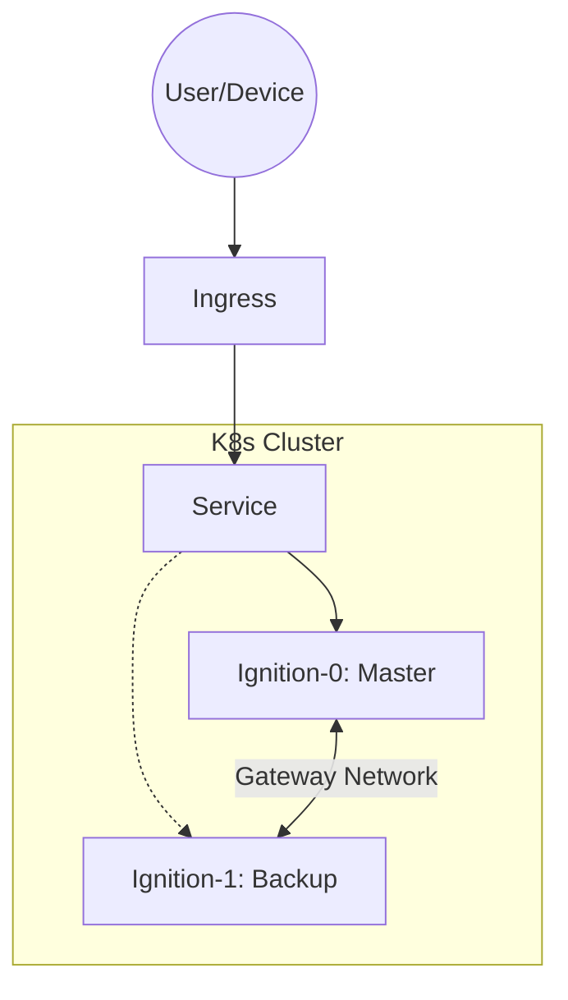
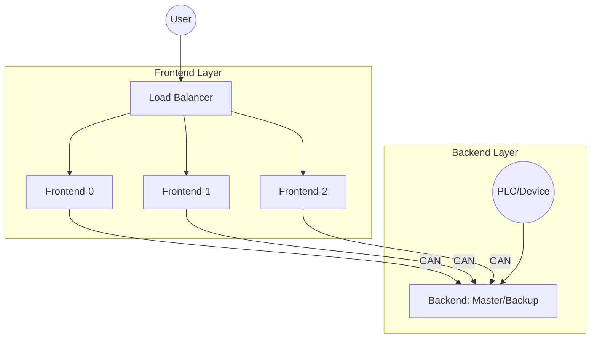

The charts offer two ways to run Ignition on Kubernetes. This page describes each one and helps you choose.

## Failover (Master/Backup)

The `ignition-failover` chart deploys one gateway, or a redundant pair, that serves both devices and users.

* **Replicas**: 1 by default; 2 with `ignition.redundancy.enabled`.
* **State**: a StatefulSet, so each gateway has a stable network identity and its own persistent volume.
* **Roles**: pod `0` is the Master and pod `1` the Backup.
* **Direct access**: besides the main Service, the chart creates two headless Services that target one pod each:
  * `<name>-primary` always points to pod `0`.
  * `<name>-backup` always points to pod `1`.

  `<name>` is `applicationName` (default `ignition-failover`).
* **Use case**: SCADA deployments that need high availability.

By default the main Service sends traffic to every Ready gateway, including a cold Backup. Set `ignition.activeRouting.enabled` to send it only to the active gateway.

```mermaid
graph TD
    User((User/Device)) --> Ingress
    Ingress --> Service
    subgraph K8s Cluster
        Service --> Pod0[Ignition-0: Master ]
        Service -.-> Pod1[Ignition-1: Backup ]
        Pod0 <-->|Gateway Network| Pod1
    end
```

## Scaleout (frontend/backend)

The `ignition-scaleout` chart splits the workload into two StatefulSets:

* **Backend**: device connections, database logging and tag history. One gateway, or a redundant pair with `backend.redundancy.enabled`.
* **Frontend**: Perspective sessions and API requests. `frontend.redundancy.replicas` gateways, or a HorizontalPodAutoscaler.

You can scale the frontend independently of the backend as user load grows.

```mermaid
graph TD
    User((User)) --> LB[Load Balancer]
    subgraph Frontend Layer
        LB --> FE1[Frontend-0]
        LB --> FE2[Frontend-1]
        LB --> FE3[Frontend-2]
    end
    subgraph Backend Layer
        FE1 -->|GAN| BE[Backend: Master/Backup]
        FE2 -->|GAN| BE
        FE3 -->|GAN| BE
        Device((PLC/Device)) --> BE
    end
```

## Choosing an architecture

The right choice depends on your user load, how much you need to isolate device communication, and how much you want to operate. The user counts below are rough guidance, not limits the charts enforce; size your gateways for your own projects.

| | Failover (Master/Backup) | Scaleout (frontend/backend) |
| :--- | :--- | :--- |
| **Primary goal** | High availability | High concurrency (user load) |
| **Typical user load** | Up to a few hundred concurrent sessions | Over a thousand concurrent sessions |
| **Complexity** | Low | High |
| **Device load** | On the same gateways as users | Isolated on the backend |
| **Gateways** | 1 or 2 | 1 or 2 backend, plus N frontend |
| **Licensing** | One gateway or redundant pair | Backend gateway or pair, plus a license per frontend gateway |

### Choose failover when

* You are deploying a factory-floor SCADA system.
* Your user count is moderate.
* Simple maintenance and licensing matter most.

### Choose scaleout when

* You are building an enterprise-wide dashboarding system.
* You expect thousands of users on Perspective sessions.
* You need to protect device communication (backend) from heavy user load (frontend).
